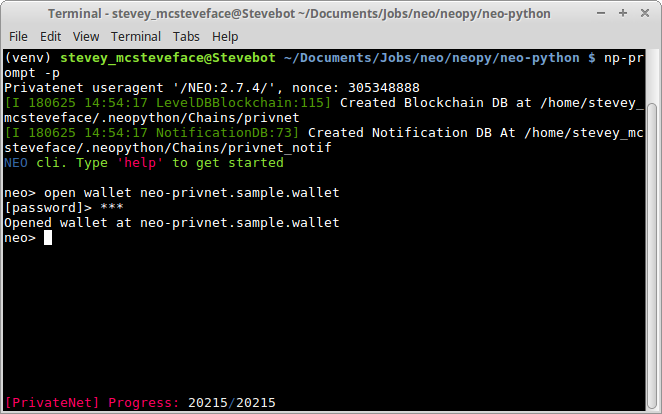
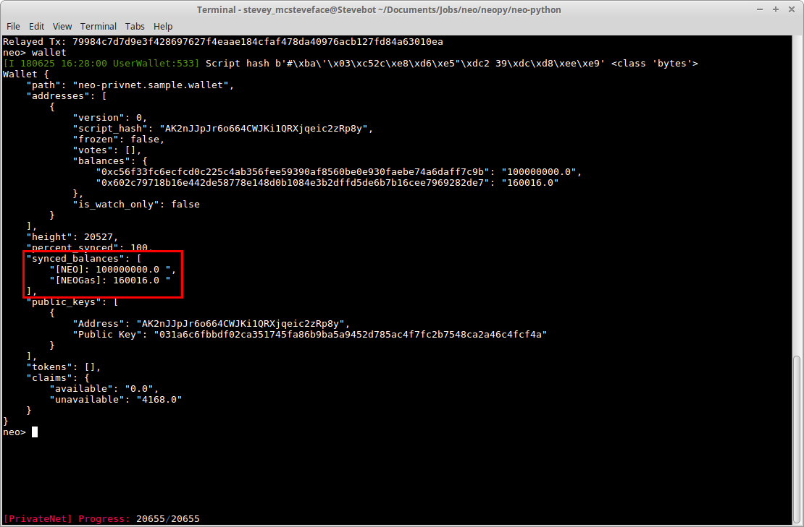
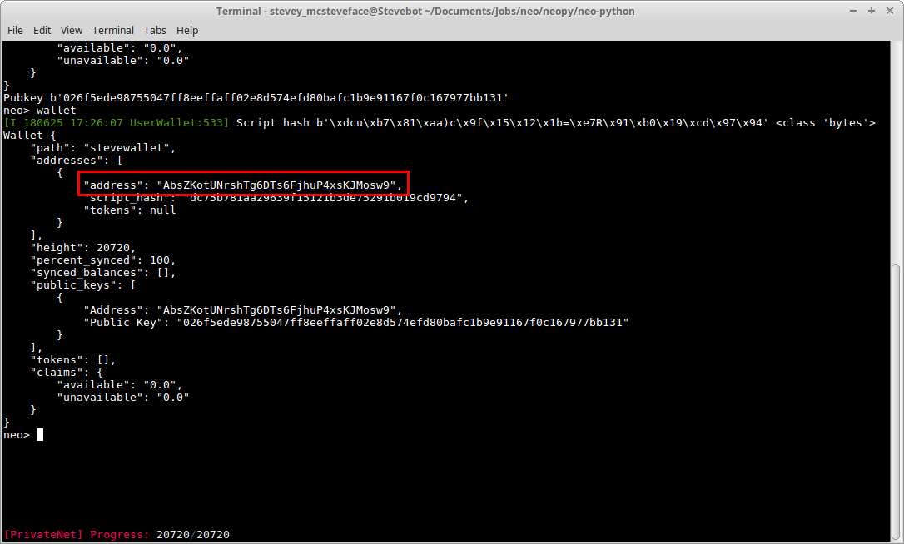

# NEO Smart Contract Workshop (Part 2)
*by [Steve](https://github.com/HandsomeJeff) for NEO*

This workshop assumes intermediate knowledge of the command line.

This portion involves interacting with neo-python command line.
___

### Workshop Details
**When**: Sunday, 1 Jul 2018. 6:30 PM - 8:30 PM.</br>
**Where**: xyz Beijing xyz</br>
**Who**: NEO

### Questions
Please raise your hand any time during the workshop or email your questions to [me](mailto:yefan0072001@gmail.com) later.

### Errors
For errors, typos or suggestions, please do not hesitate to [post an issue](https://github.com/HandsomeJeff/NEO-smart-contract-workshop). Pull requests are very welcome! Thanks!

___

## Task 2 - Wallet Operations

#### 2.1 help
Type `help` to get a list of available commands. Here's what you'll see:

```
quit
help
block {index/hash} (tx)
header {index/hash}
tx {hash}
asset {assetId}
asset search {query}
contract {contract hash}
contract search {query}
notifications {block_number or address}
mem
nodes
state
config debug {on/off}
config sc-events {on/off}
config maxpeers {num_peers}
build {path/to/file.py} (test {params} {returntype} {needs_storage} {needs_dynamic_invoke} {test_params})
load_run {path/to/file.avm} (test {params} {returntype} {needs_storage} {needs_dynamic_invoke} {test_params})
import wif {wif}
import nep2 {nep2_encrypted_key}
import contract {path/to/file.avm} {params} {returntype} {needs_storage} {needs_dynamic_invoke}
import contract_addr {contract_hash} {pubkey}
import multisig_addr {pubkey in wallet} {minimum # of signatures required} {signing pubkey 1} {signing pubkey 2}...
import watch_addr {address}
import token {token_contract_hash}
export wif {address}
export nep2 {address}
open wallet {path}
create wallet {path}
wallet {verbose}
wallet claim (max_coins_to_claim)
wallet migrate
wallet rebuild {start block}
wallet delete_addr {addr}
wallet delete_token {token_contract_hash}
wallet alias {addr} {title}
wallet tkn_send {token symbol} {address_from} {address to} {amount}
wallet tkn_send_from {token symbol} {address_from} {address to} {amount}
wallet tkn_approve {token symbol} {address_from} {address to} {amount}
wallet tkn_allowance {token symbol} {address_from} {address to}
wallet tkn_mint {token symbol} {mint_to_addr} (--attach-neo={amount}, --attach-gas={amount})
wallet tkn_register {addr} ({addr}...) (--from-addr={addr})
wallet tkn_history {token symbol}
wallet unspent
wallet close
withdraw_request {asset_name} {contract_hash} {to_addr} {amount}
withdraw holds # lists all current holds
withdraw completed # lists completed holds eligible for cleanup
withdraw cancel # cancels current holds
withdraw cleanup # cleans up completed holds
withdraw # withdraws the first hold availabe
withdraw all # withdraw all holds available
send {assetId or name} {address} {amount} (--from-addr={addr})
sign {transaction in JSON format}
testinvoke {contract hash} {params} (--attach-neo={amount}, --attach-gas={amount}) (--from-addr={addr})
debugstorage {on/off/reset}
```

#### 2.2 Opening a Wallet

Now it is time to open a wallet to perform some functionos that would otherwise be unavailable. We'll be using a sample wallet that comes with the Docker container. Run the command `open wallet neo-privnet.sample.wallet`. The password is `coz`.




Let's check the contents of our wallet. We can show wallet details with the command `wallet`.


As you can see, we've got a ton of 100M NEO and 16k Gas in our wallet (**1**). We also see in (**2**) that we have a bunch (140k!) of *claims* available. We can claim this Gas with the command `wallet claim 143992` (the number 143992 is the amount fo claimable Gas I have). Enter the password `coz` to confirm.

Now, if you enter the command `wallet again`, you'll see that we have 160k Gas in our balances.




*If there is anything wrong with your wallet, you can rebuild it with* `wallet rebuild`.


#### 2.3 Creating a new Wallet

Let's try creating a personal wallet. The command is `create wallet {path}`, where {path} is the location where you want to store the wallet. I entered `create wallet stevewallet`, because I'm Steve and this is my wallet. It is stored in the same directory


As you can see, there is no NEO and Gas here. Let's fix that, shall we?

#### 2.4 Sending Tokens

To send tokens to a wallet, we first need to know the address of the wallet. From `wallet`, we can see that my wallet address is `AbsZKotUNrshTg6DTs6FjhuP4xsKJMosw9`.



**Keep in mind that your address might be something else! It is unlikely that we have the same wallet address.**

Copy the wallet address and keep it somewhere safe.

Then, open the sample wallet again with `open wallet neo-privnet.sample.wallet`. The password is still `coz`. This will close our current wallet (stevewallet) and open the sample wallet.

Now, let's send ourselves some NEO and Gas! We'll send ourselves 10k of each asset.

```
send neo {address} 10000
send gas {address} 10000
```

{address} is our own wallet address. So in my case it'll look like
```
send neo AbsZKotUNrshTg6DTs6FjhuP4xsKJMosw9 10000
send gas AbsZKotUNrshTg6DTs6FjhuP4xsKJMosw9 10000
```

Finally, we open our own wallet again `wallet open stevewallet` and enter the command `wallet`.


We now have 10k NEO and Gas in our wallet!

*If you do not see your assets right away, wait for 15-20 seconds and check again. That should be enough time for the transaction to be confirmed*

## Task 3 - Smart Contracts


## Acknowledgements

Special Thanks to [Jonboy](https://github.com/jonathanlimwj) and [Chris Hager](https://github.com/metachris).
