# NEO Smart Contract Workshop (Part 2)
*by [Steve](https://github.com/HandsomeJeff) for NEO*

This workshop assumes intermediate knowledge of the command line.

This portion involves interacting with neo-python command line.
___

### Workshop Details
**When**: Sunday, 1 Jul 2018. 1:30 PM - 5:30 PM.</br>
**Where**: 太库北京孵化器</br>
**Who**: NEO

### Questions
Please raise your hand any time during the workshop or email your questions to [me](mailto:yefan0072001@gmail.com) later.

### Errors
For errors, typos or suggestions, please do not hesitate to [post an issue](https://github.com/HandsomeJeff/NEO-smart-contract-workshop). Pull requests are very welcome! Thanks!

___

## Task 2 - Wallet Operations

#### 2.1 help
Type `help` to get a list of available commands. Here's what you'll see:

```
quit
help
block {index/hash} (tx)
header {index/hash}
tx {hash}
asset {assetId}
asset search {query}
contract {contract hash}
contract search {query}
notifications {block_number or address}
mem
nodes
state
config debug {on/off}
config sc-events {on/off}
config maxpeers {num_peers}
build {path/to/file.py} (test {params} {returntype} {needs_storage} {needs_dynamic_invoke} {test_params})
load_run {path/to/file.avm} (test {params} {returntype} {needs_storage} {needs_dynamic_invoke} {test_params})
import wif {wif}
import nep2 {nep2_encrypted_key}
import contract {path/to/file.avm} {params} {returntype} {needs_storage} {needs_dynamic_invoke}
import contract_addr {contract_hash} {pubkey}
import multisig_addr {pubkey in wallet} {minimum # of signatures required} {signing pubkey 1} {signing pubkey 2}...
import watch_addr {address}
import token {token_contract_hash}
export wif {address}
export nep2 {address}
open wallet {path}
create wallet {path}
wallet {verbose}
wallet claim (max_coins_to_claim)
wallet migrate
wallet rebuild {start block}
wallet delete_addr {addr}
wallet delete_token {token_contract_hash}
wallet alias {addr} {title}
wallet tkn_send {token symbol} {address_from} {address to} {amount}
wallet tkn_send_from {token symbol} {address_from} {address to} {amount}
wallet tkn_approve {token symbol} {address_from} {address to} {amount}
wallet tkn_allowance {token symbol} {address_from} {address to}
wallet tkn_mint {token symbol} {mint_to_addr} (--attach-neo={amount}, --attach-gas={amount})
wallet tkn_register {addr} ({addr}...) (--from-addr={addr})
wallet tkn_history {token symbol}
wallet unspent
wallet close
withdraw_request {asset_name} {contract_hash} {to_addr} {amount}
withdraw holds # lists all current holds
withdraw completed # lists completed holds eligible for cleanup
withdraw cancel # cancels current holds
withdraw cleanup # cleans up completed holds
withdraw # withdraws the first hold availabe
withdraw all # withdraw all holds available
send {assetId or name} {address} {amount} (--from-addr={addr})
sign {transaction in JSON format}
testinvoke {contract hash} {params} (--attach-neo={amount}, --attach-gas={amount}) (--from-addr={addr})
debugstorage {on/off/reset}
```

#### 2.2 Opening a Wallet

Now it is time to open a wallet to perform some functionos that would otherwise be unavailable. We'll be using a sample wallet that comes with the Docker container. Run the command `open wallet neo-privnet.sample.wallet`. The password is `coz`.


Let's check the contents of our wallet. We can show wallet details with the command `wallet`.

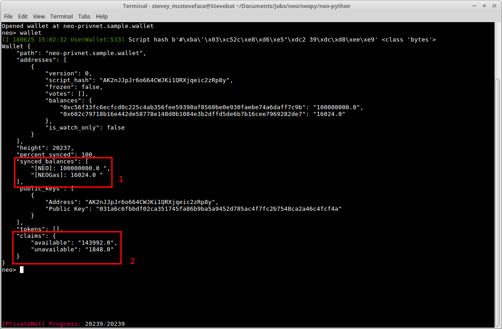

As you can see, we've got a ton of 100M NEO and 16k Gas in our wallet (**1**). We also see in (**2**) that we have a bunch (140k!) of *claims* available. We can claim this Gas with the command `wallet claim 143992` (the number 143992 is the amount fo claimable Gas I have). Enter the password `coz` to confirm.

Now, if you enter the command `wallet again`, you'll see that we have 160k Gas in our balances.


*If there is anything wrong with your wallet, you can rebuild it with* `wallet rebuild`.


#### 2.3 Creating a new Wallet

Let's try creating a personal wallet. The command is `create wallet {path}`, where {path} is the location where you want to store the wallet. I entered `create wallet stevewallet`, because I'm Steve and this is my wallet. It is stored in the same directory

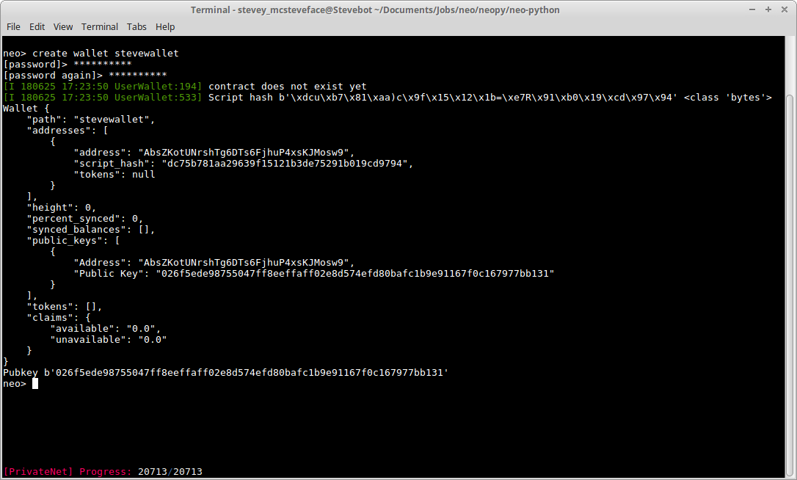

As you can see, there is no NEO and Gas here. Let's fix that, shall we?

#### 2.4 Sending Tokens

To send tokens to a wallet, we first need to know the address of the wallet. From `wallet`, we can see that my wallet address is `AbsZKotUNrshTg6DTs6FjhuP4xsKJMosw9`.


**Keep in mind that your address might be something else! It is unlikely that we have the same wallet address.**

Copy the wallet address and keep it somewhere safe.

Then, open the sample wallet again with `open wallet neo-privnet.sample.wallet`. The password is still `coz`. This will close our current wallet (stevewallet) and open the sample wallet.

Now, let's send ourselves some NEO and Gas! We'll send ourselves 10k of each asset.

```
send neo {address} 10000
send gas {address} 10000
```

{address} is our own wallet address. So in my case it'll look like
```
send neo AbsZKotUNrshTg6DTs6FjhuP4xsKJMosw9 10000
send gas AbsZKotUNrshTg6DTs6FjhuP4xsKJMosw9 10000
```

Finally, we open our own wallet again `wallet open stevewallet` and enter the command `wallet`.

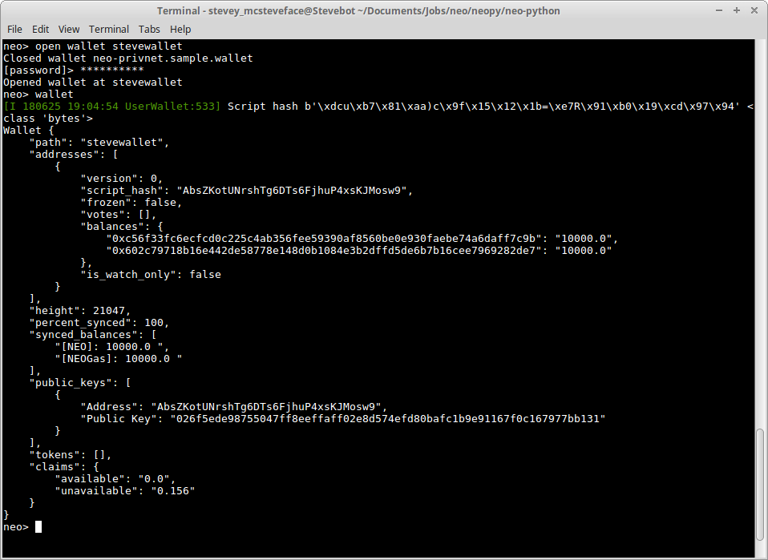

We now have 10k NEO and Gas in our wallet!

*If you do not see your assets right away, wait for 15-20 seconds and check again. That should be enough time for the transaction to be confirmed*

## Task 3 - Smart Contracts

Okay, so we messed with our wallets and made a couple of transactions. Now let's try deploying some smart contracts!

For the purpose of this workshop, I will use **programs** and **smart contracts** interchangeably.

First, download the `smart-contracts` folder and place it in the neo-python folder.

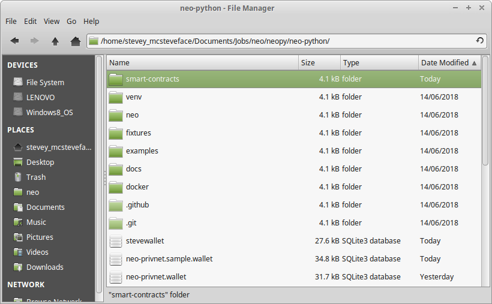

We should have 5 files inside:
1. 1-print.py
2. 2-print-and-notify.py
3. 3-storage.py
4. 4-domain.py
5. 5-calculator.py


#### 3.1 Hello World
The first program most programmers write is `hello world`. It's simple, efficient, and we can easily see the output.

On the NEO blockchain, the contract goes in the following order:
1. Build
2. Deploy
3. Invoke

##### 3.1.1 Build Contract

First, enter the command `config sc-events on`. Then try the command <br>`build smart-contracts/1-print.py test ff ff False False`.

*If you get a "No such file or directory" error, try using the full path of 1-print.py*

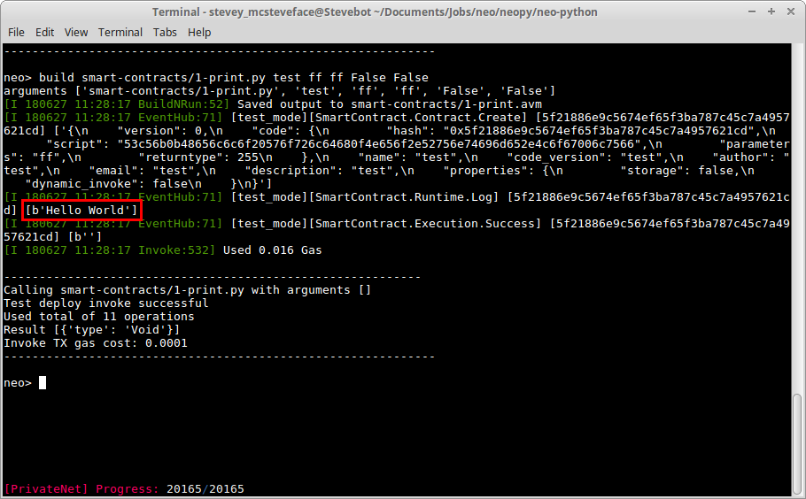

We can see under `SmartContract.Runtime.Log`, there is a 'Hello World' printed. This is the outcome of our program.

The command for building a smart contract is <br> `build {path/to/file.py} (test {params} {returntype} {needs_storage} {needs_dynamic_invoke} {test_params})`

Let's break it down:
* `{path/to/file.py}` is the path to the python file we want to build.
* `test`: the word "test" has to be typed if we want to test the contract.
* `{params}` is the type of input parameters, if any, that this contract accept.
* `{returntype}` is the type of value, if any, that this contract returns.
* `{needs_storage}` is a boolean that tells the blockchain if our contract requries storage.
* `{needs_dynamic_invoke}` is a boolean that tells the blockchain if our contracts requires special conditions to execute.
* `{test_params}` are the actual input parameter values that we might want to test with, if any. Note that `test` has to be typed.

For `{params}` and `{returntype}`, the appropriate values for the commands are as follows:

<!-- | Parameter Type | Signature | Boolean | Integer | Hash160 | Hash256 | ByteArray | PublicKey | String | Array | InteropInterface | void |
| --- |
| **Value of param** | 00 | 01 | 02 | 03 | 04 | 05 | 06 | 07 | 10 | f0 | ff | -->

| Parameter Type | Value of param |
| --- | --- |
| Signature | `00` |
| Boolean | `01` |
| Integer | `02` |
| Hash160 | `03` |
| Hash256 | `04` |
| ByteArray | `05` |
| PublicKey | `06` |
| String | `07` |
| Array | `10` |
| InteropInterface | `f0` |
| void | `ff` |

Since our `hello world` program requires no input, output, storage, or special run conditions, we can build it with <br> `build smart-contract/1-print.py ff ff False False`. <br> *We can omit the word `test`, if we want to build it wihout testing*

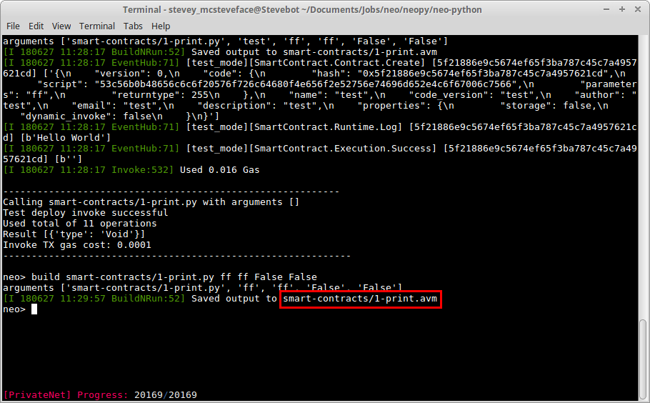

We see something called `1-print.avm`. What's this `.avm`? Well, NEO cannot read and execute python programs natively, only `.avm` programs. So a compiler has to compile our `.py` file into a `.avm` file before we can deploy it.

##### 3.1.2 Deploy Contract
Now that we have a proper `.avm` smart contract, it's time to deploy it!

For that, we'll run the command <br> `import contract smart-contracts/1-print.avm ff ff False False`

You'll be prompted to fill in the following:
1. Contract Name
2. Contract Version
3. Contract Author
4. Contract Email
5. Contract Description

You can technically fill in anything you like, but try to write something that makes sense and is easy to remember.

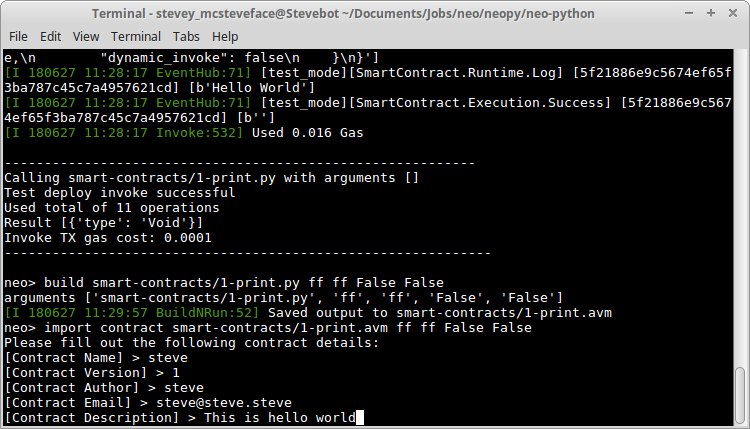

Enter the password and wait for about 15-20 seconds, or till you see a bunch of random-looking text pop up.

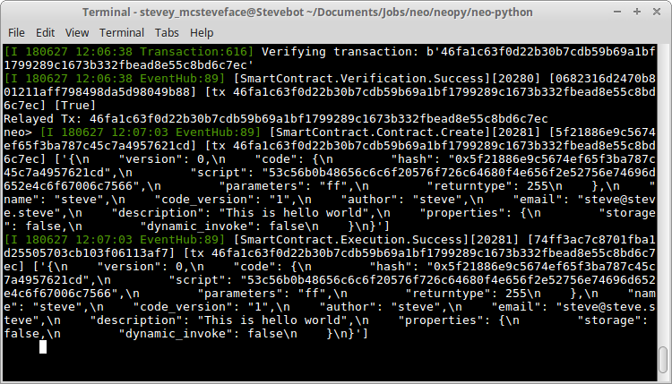

We have now successfully deployed `hello world` to our blockchain!

##### 3.1.3 Invoke Contract

To invoke our contract, we're gonna need our contract hash. To see our contract hash, try searching for your contract with the command `contract search {contract info}`. For me, `{contract info}` will be `steve`.

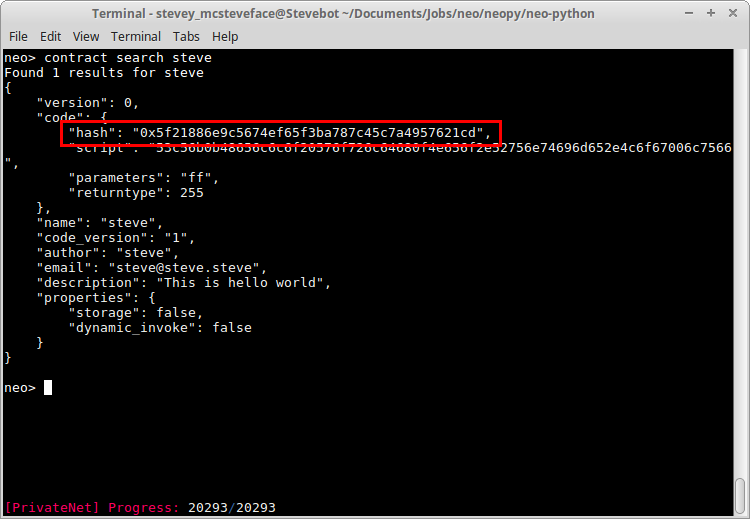

I can see that the contract hash for my 'steve contract' is `0x5f21886e9c5674ef65f3ba787c45c7a4957621cd`. Next, enter the command `testinvoke {contract hash}`, where `{contract hash}` is your own contract hash. Enter your password to confirm.

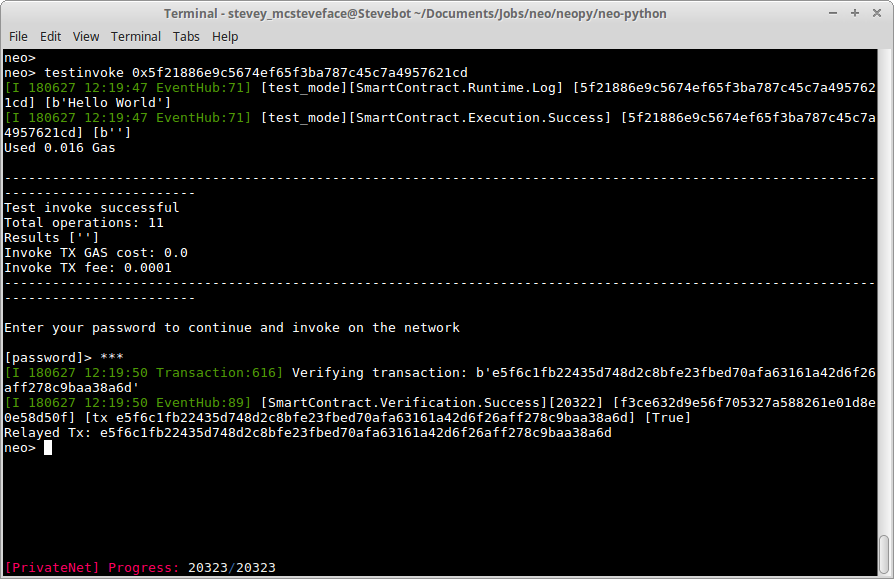

After a few seconds, you should see a bunch of text pop up:

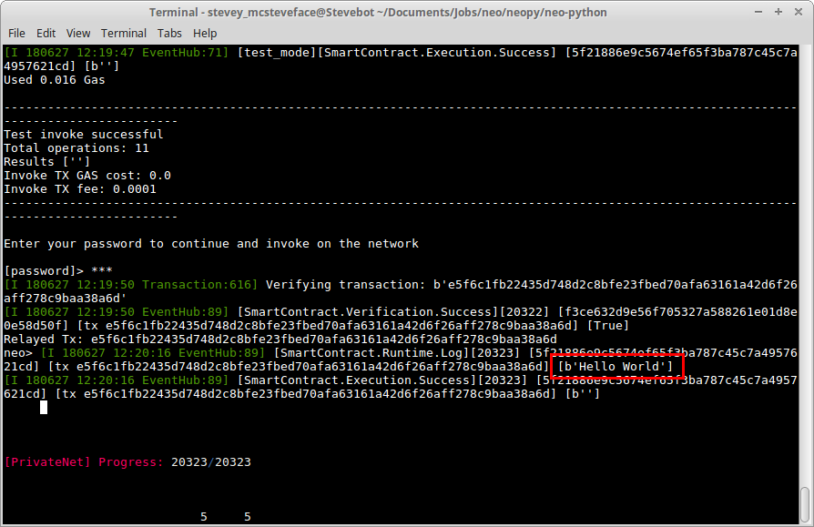

Once again under `SmartContract.Runtime.Log`, there is a 'Hello World' printed. We have successfully invoked a smart contract from our blockchain!

#### 3.2 Print and Notify

Now let's go through the second smart contract.
 <br>`build smart-contracts/2-print-and-notify.py test ff ff False False`

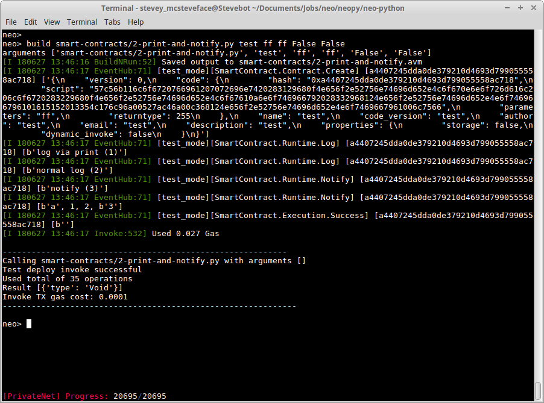

Here we see the difference between `print()`, `log()`, and `notify()`. The first two functions are essentially the same - they both appear under `SmartContract.Runtime.Log`. `notify()`, however, appears under `SmartContract.Runtime.Notify`. In addition, it can display multiple arguments.

#### 3.3 Calculator

Now let's try something a little different: a calculator program that takes in multiple inputs and returns a value. This contract takes in three parameters: string, integer, integer. It then returns an integer. Hence our input parameters is 070202 and return type is 02.
 <br>`build smart-contracts/3-calculator.py test 070202 02 False False add 1 2`

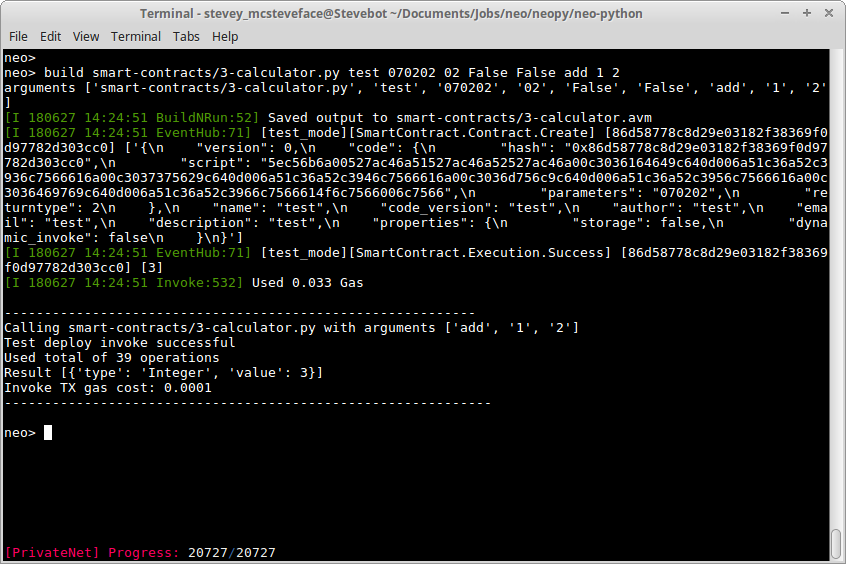

In our command, we've included test parameters 'add', '1', and '2'. If we look at the source code, what we are doing is telling the program to add 1 and 2 together. We can see the return value of '3', which is probably the correct answer.

Deploy the calculator <br> `import contract smart-contracts/3-calculator.avm 070202 02 False False`

Now we need to get the contract hash once again to invoke it. We can either do a search `contract search calculator`, or scroll up to right when we deployed our contract, to find the hash.

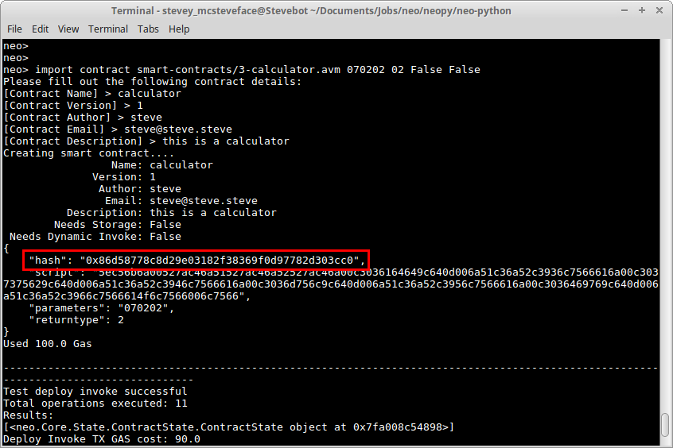

At this point, let's invoke our contract and make it, say, multiply 3 with 7. <br> `testinvoke 0x86d58778c8d29e03182f38369f0d97782d303cc0 mul 3 7`

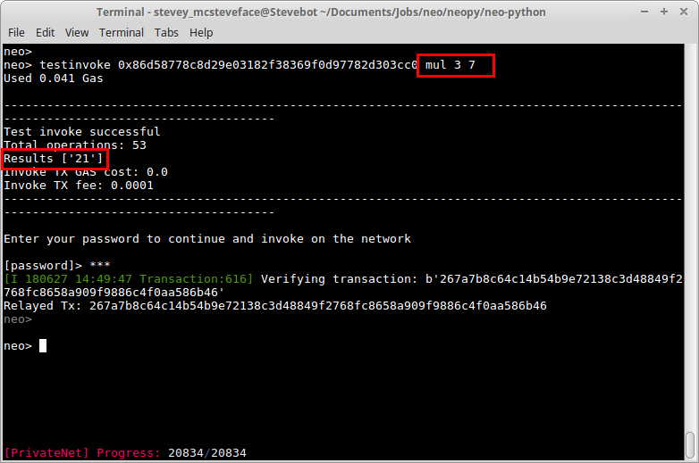

As we can see, 3 multiplied by 7 gives 21.

#### 3.4 Storage

Next up, we have a program that always remembers. First, run `debugstorage on`.

Then run jjjjj

Note that `{needs_storage}` is set to `True`, because we want to store values on this contract.

Take a look at the value here. It says 1.

Run

#### 3.5 Domain Name Service

The next contract we're working with involves Domain Name Services (DNS) on our blockchain. That is to say, we can register our wallet addresses with unique names.


## Acknowledgements

Special Thanks to [Jonboy](https://github.com/jonathanlimwj) and [Chris Hager](https://github.com/metachris).
